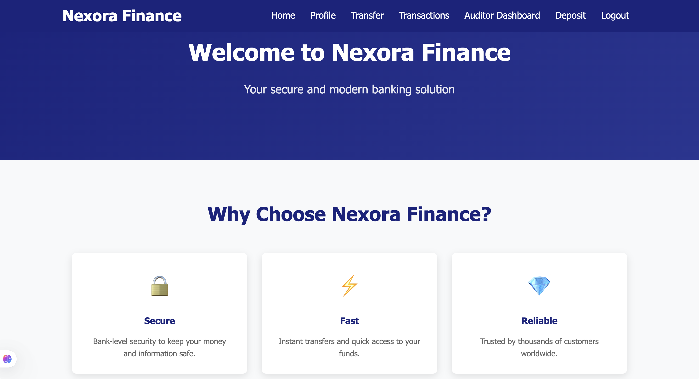

# 💳 Nexora Finance - Frontend

A modern and responsive **FinTech Banking Application UI** built with **React.js** that provides users with a seamless and secure digital banking experience.

The frontend communicates with the Spring Boot backend using **JWT authentication** and offers real-time banking operations such as deposits, withdrawals, transfers, and account management.

---

## 📸 Project Preview



---

## ✨ Features

### 🔐 Authentication

* User Registration
* Secure Login using JWT
* Protected Routes
* Automatic Session Management

### 💰 Banking Features

* Deposit Money
* Withdraw Money
* Transfer Funds
* View Account Details
* Transaction History

### 📧 Notifications

* Email-based Password Reset
* Transaction Alerts
* User Notifications

### 🎨 User Experience

* Responsive Design
* Modern UI/UX
* Fast Single Page Application (SPA)
* Dynamic Data Rendering

---

## 🛠 Tech Stack

| Technology             | Purpose             |
| ---------------------- | ------------------- |
| React.js               | Frontend Framework  |
| React Router           | Client-side Routing |
| Axios                  | API Communication   |
| JWT                    | Authentication      |
| CSS/Tailwind/Bootstrap | Styling             |
| Vite/Create React App  | Build Tool          |

> Update the styling and build tool based on your project.

---

## 🏗 Application Architecture

```text
React Frontend
       ↓
Axios API Calls
       ↓
Spring Boot Backend
       ↓
JWT Authentication
       ↓
MySQL/PostgreSQL
```

---

## 📂 Project Structure

```bash
src
 ├── components
 ├── pages
 ├── services
 ├── hooks
 ├── context
 ├── utils
 ├── assets
 ├── routes
 └── App.jsx
```

---

## 🚀 Getting Started

### Clone the Repository

```bash
git clone https://github.com/your-username/nexora-finance-frontend.git
cd nexora-finance-frontend
```

### Install Dependencies

```bash
npm install
```

### Configure Environment Variables

Create a `.env` file in the root directory:

```env
VITE_API_URL=http://localhost:8080/api
```

> If you are using Create React App:

```env
REACT_APP_API_URL=http://localhost:8080/api
```

---

## ▶️ Run the Application

```bash
npm run dev
```

For Create React App:

```bash
npm start
```

Application runs at:

```bash
http://localhost:5173
```

---

## 🔐 Authentication Flow

1. User logs in with credentials.
2. Backend returns a JWT token.
3. Token is stored securely.
4. Every API request includes the JWT token.
5. Protected routes are accessible only to authenticated users.

---

## 🌟 Key Functionalities

* Dashboard Overview
* Account Management
* Fund Transfers
* Transaction History
* Profile Management
* Secure Authentication

---

## 🔄 API Integration

The frontend communicates with the backend through REST APIs for:

* Authentication
* User Management
* Banking Transactions
* Notifications
* Audit Information

---

## 📱 Responsive Design

The application is optimized for:

✅ Desktop
✅ Tablet
✅ Mobile Devices

---

## 🚀 Future Enhancements

* Dark Mode
* Real-Time Notifications
* Multi-Language Support
* Two-Factor Authentication (2FA)
* Data Visualization Dashboard

---

## 🤝 Contributing

Contributions are welcome!

1. Fork the repository
2. Create your feature branch
3. Commit your changes
4. Push to the branch
5. Open a Pull Request

---

## 👨‍💻 Author

**Naman Kaushik**

Built with ❤️ using React, JWT Authentication, and modern web technologies.
